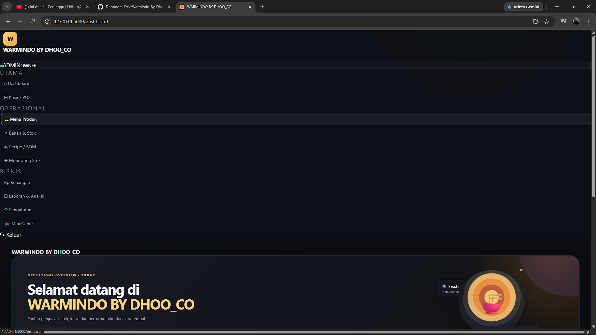
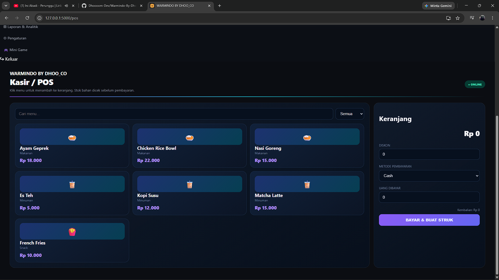
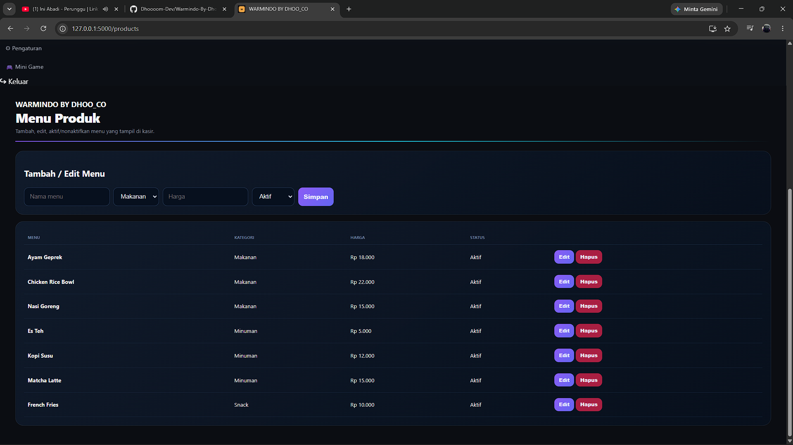
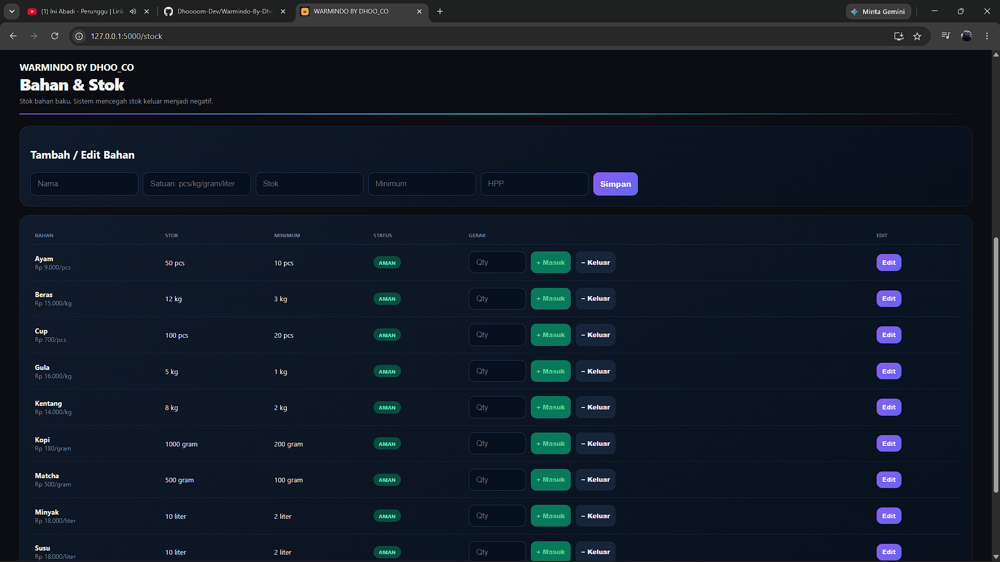
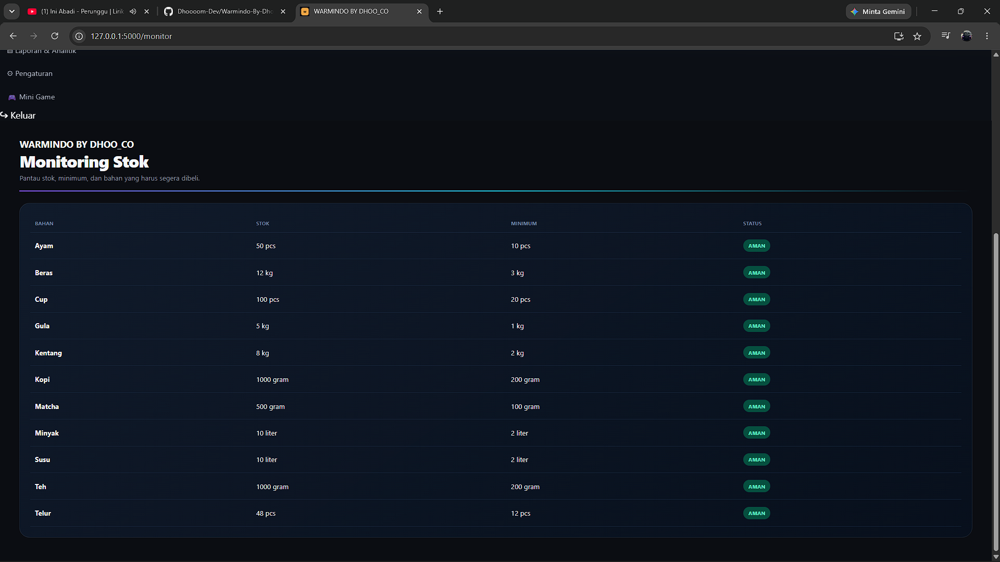
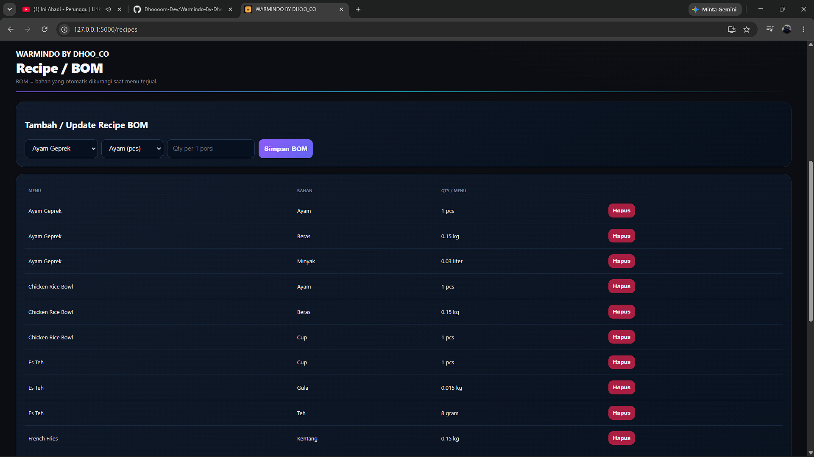
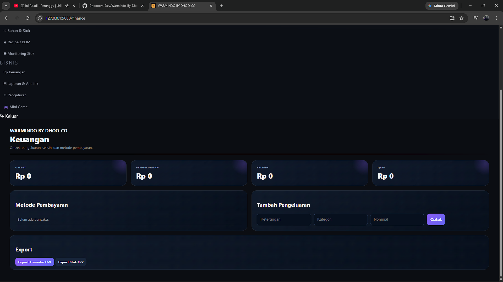
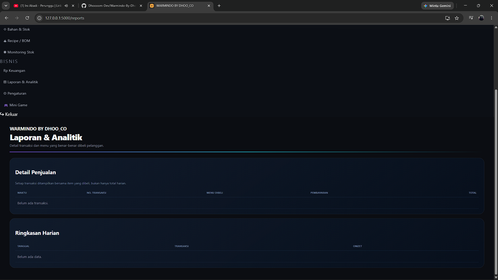
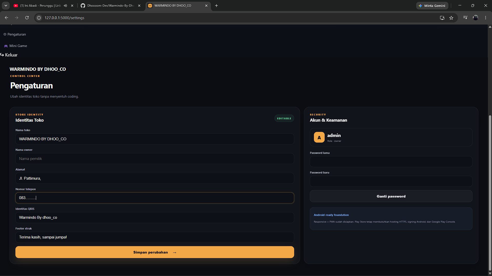
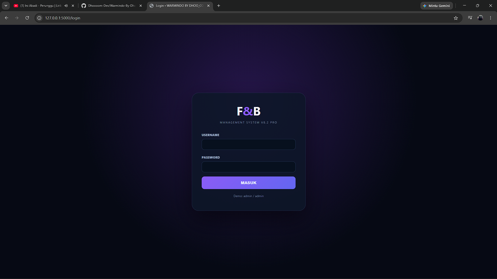

# F&B Management System

Sistem manajemen F&B terintegrasi untuk membantu operasional UMKM dan bisnis kuliner dalam mengelola kasir (POS), menu, stok bahan baku, resep/BOM, keuangan, dan laporan penjualan.

Project ini terus dikembangkan dari sistem awal berbasis Python menjadi sistem POS yang lebih modern, responsif, dan dipersiapkan untuk penggunaan pada smartphone dan tablet Android.

## Fitur yang sudah dikembangkan

- Login & Authentication
- Dashboard operasional
- Kasir / POS
- Cash / QRIS / metode pembayaran lainnya
- Perhitungan kembalian
- Manajemen menu
- Manajemen stok
- Recipe / BOM
- Monitoring stok
- Keuangan
- Laporan & analitik
- Struk transaksi
- Pengaturan identitas toko
- Nama toko dan owner yang dapat diubah
- Informasi QRIS dan footer struk
- Responsive UI
- PWA foundation
- Android/Capacitor foundation

## V11 — Android Development

Fokus V11 adalah membawa sistem dari prototype web/PWA menuju aplikasi Android untuk smartphone dan tablet.

Target pengembangan:
- Offline-first POS
- Database lokal
- Sinkronisasi data
- Thermal printer
- Backup & restore
- Multi-user role
- APK/AAB
- Pengujian tablet
- Persiapan Google Play Store

## Tech Stack

- Python 3.x
- Flask
- SQLite
- HTML / CSS / JavaScript
- PWA
- Capacitor / Android Studio (Android phase)

Default demo branding: **Warmindo By dhoo_co**. Identitas toko dapat diubah melalui Pengaturan.

## Screenshots

### Main Interface

| Home | Dashboard |
|---|---|
|  |  |

### Point of Sale

| Kasir / POS | Menu |
|---|---|
|  |  |

### Inventory

| Bahan & Stok | Monitoring Stok |
|---|---|
|  |  |

### Recipe & Finance

| Recipe / BOM | Keuangan |
|---|---|
|  |  |

### Reports & Settings

| Laporan & Analitik | Pengaturan |
|---|---|
|  |  |

### Authentication

